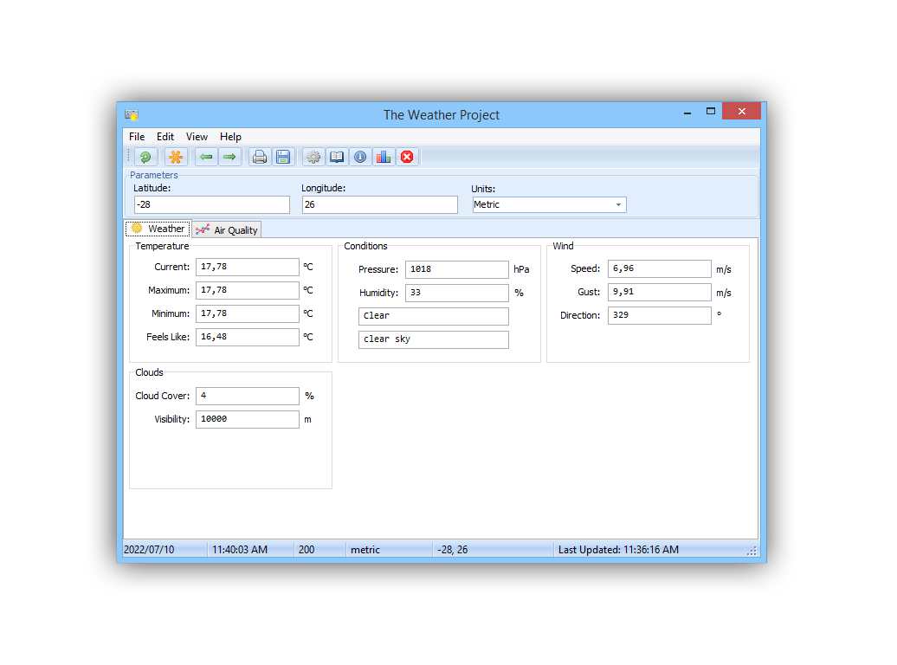

## The Weather Project
A Delphi application made for Windows that provides weather and air quality data in real time from the OpenWeatherMap API
***
### Latest Version 
Current Version - Update 1 for v1.0.0.0 (v1.0.0.1)  
- See Release changelog for changes and change information 
***
### Preview

***
### License 
Copyright (c) 2022 Connor Bell
Permission is hereby granted, free of charge, to any person obtaining a copy
of this software and associated documentation files (the "Software"), to deal
in the Software without restriction, including without limitation the rights
to use, copy, modify, merge, publish, distribute and to permit persons to whom the Software is
furnished to do so, subject to the following conditions:

The above copyright notice and this permission notice shall be included in all
copies or substantial portions of the Software.

THE SOFTWARE IS PROVIDED "AS IS", WITHOUT WARRANTY OF ANY KIND, EXPRESS OR
IMPLIED, INCLUDING BUT NOT LIMITED TO THE WARRANTIES OF MERCHANTABILITY,
FITNESS FOR A PARTICULAR PURPOSE AND NONINFRINGEMENT. IN NO EVENT SHALL THE
AUTHORS OR COPYRIGHT HOLDERS BE LIABLE FOR ANY CLAIM, DAMAGES OR OTHER
LIABILITY, WHETHER IN AN ACTION OF CONTRACT, TORT OR OTHERWISE, ARISING FROM,
OUT OF OR IN CONNECTION WITH THE SOFTWARE OR THE USE OR OTHER DEALINGS IN THE
SOFTWARE.

***
### Feedback 
Feedback is greatly appreciated and can be sent to: 
- connorbell27@icloud.com
- +27 66 202 1724
***
### Help Documentation 
The applicaiton help documentation is coming soon and will be available under the code section as a .PDF
***
### README Info
Last Updated: 10 July 2022 - Connor Bell
