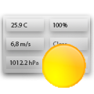

## The Weather Project
A Delphi application made for Windows that provides weather and air quality data in real time from the OpenWeatherMap API
***
### Latest Version 
Current Version 1.0.0.0 
- No Changes yet
***
### Preview

***
### License 
***
### Feedback 
Feedback is greatly appreciated and can be sent to: 
- connorbell27@icloud.com
- +27 66 202 1724
***
### README Info
Last Updated: 10 July 2022 - Connor Bell
